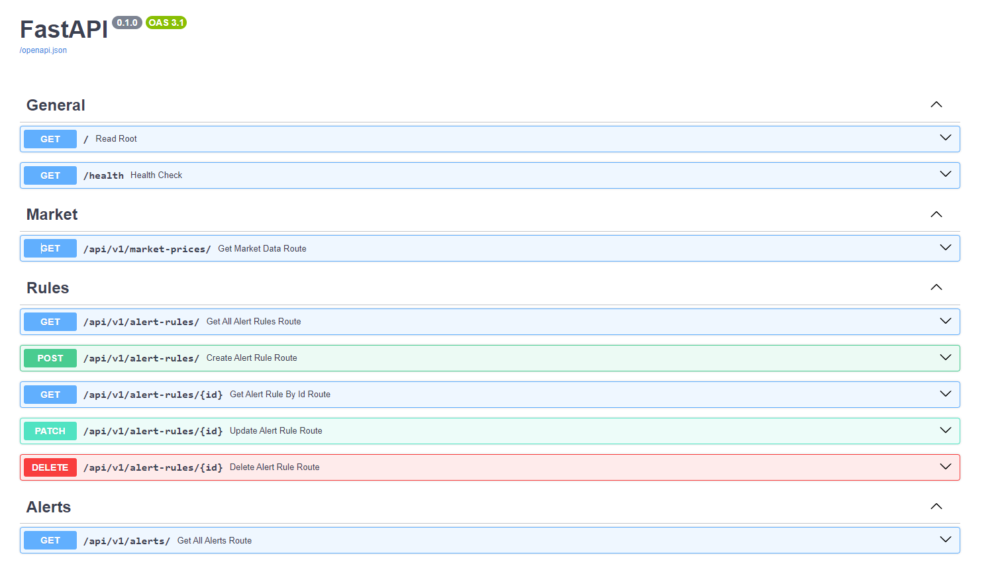

# Investor Bulletin


## Table of Contents
- [Technology Used](#technology-used)
- [Prerequisites](#prerequisites)
- [Notes](#notes)
- [Objectives](#objectives)
- [Functionality](#functionality)
- [Routes and Descriptions](#routes-and-descriptions)
- [Usage](#usage)
- [Logic Workflow](#logic-workflow)
- [System Overview Workflow](#system-overview-workflow)
- [Testing](#testing)

## Technology Used
- **Web Server**: [FastAPI](https://fastapi.tiangolo.com/)
- **ORM**: [SQLAlchemy](https://fastapi.tiangolo.com/advanced/async-sql-databases/?h=sqlalchemy#import-and-set-up-sqlalchemy)
- **Database**: [CockroachDB](https://www.cockroachlabs.com/)
- **Schema Validation**: [Pydantic](https://fastapi.tiangolo.com/tutorial/body-nested-models/)
- **Database Migrations**: [Alembic](https://alembic.sqlalchemy.org/en/latest/)
- **Message Broker**: [RabbitMQ](https://www.rabbitmq.com/)

## Prerequisites
Before you begin, ensure you have met the following requirements:

- **Python 3.11**: Make sure you have Python 3.11 or a compatible version installed on your system.

- **Twelvedata API Key**: Create an account and obtain an API key from [Twelvedata](https://rapidapi.com/twelvedata/api/twelve-data1) or your preferred stock data API provider.

- **Docker**: Ensure you have Docker installed on your system. You can download and install Docker from [Docker's official website](https://www.docker.com/get-started).

- **Shell Access**: For those on macOS or Linux, you'll be using your terminal. Windows users should go with Windows Subsystem for Linux (WSL) or use Bash for a compatible shell experience. If you're new to WSL, [here's a guide to get started](https://learn.microsoft.com/en-us/windows/wsl/install).


## Notes

- ⚠️🚨 Caution: When querying **Twelvedata API**, stay within the 800 requests/day limit to avoid issues (429 HTTP Code Status - Too Many Requests).


## Objectives
The objective of this project is to build a FastAPI server that retrieves the latest stock market prices from an external resource (Rapid API - Twelvedata) and allows users to manage custom alert rules by persisting them in a database.

## Functionality
- Retrieve the latest market prices for specific symbols (AAPL, MSFT, GOOG, AMZN, META) ✅.
- Create alert rules with properties: name, threshold price, and symbol ✅.
- Update alert rules by ID ✅.
- Delete alert rules by ID ✅.
- Get a list of all alert rules ✅.
- Get a list of all alerts ✅.
- Integrate RabbitMQ for message handling ✅.
- Support background task execution ✅.

## Routes and Descriptions
| HTTP Method | Route                | Description                                                           |
|-------------|----------------------|-----------------------------------------------------------------------|
| GET         | `/health`            | Health check endpoint to ensure the service is running properly.     |
| GET         | `/`            | Root endpoint.     |
| GET         | `/api/v1/market-prices`     | Returns the latest market prices for mentioned symbols (AAPL, MSFT, GOOG, AMZN, META). |
| POST        | `/api/v1/alert-rules`       | Creates an alert rule with properties:                                 |
|             |                      | - `name`: Name of the alert rule.                                     |
|             |                      | - `threshold_price`: Threshold price for triggering the alert.          |
|             |                      | - `symbol`: Symbol associated with the alert.                          |
| PATCH       | `/api/v1/alert-rules/{id}`  | Updates an alert rule by ID.                                          |
| DELETE      | `/api/v1/alert-rules/{id}`  | Deletes an alert rule by ID.                                          |
| GET         | `/api/v1/alert-rules`       | Returns a list of all alert rules.                                     |
| GET         | `/api/v1/alerts`            | Returns a list of all alerts.                                         |

## Logic Workflow


## System Overview Workflow


## Usage
Provide instructions on how to run the project, including any environment variables that need to be set, API authentication, and any other relevant details.

```bash
# Clone the repository
$ git clone https://github.com/qahta0/investor_bulletin

# CD to the repository
$ cd investor_bulletin/src

# Move .env.example to .env
$ mv .env.example .env

# Fill the environment variables in the .env file
RAPIDAPI_KEY=
RAPIDAPI_HOST=
DATABASE_URL=
RABBITMQ_HOST=
RABBITMQ_USER=
RABBITMQ_PASSWORD=
RABBITMQ_QUEUE=

# Create Python Virtualenv
$ python3 -m venv investor_bulletin

# Activate Python Virtualenv
$ source investor_bulletin/bin/activate

# Install dependencies
$ pip3 install -r requirements.txt

# Run underling infrastructure
$ cd dev_setup/ && make up && chmod a+x up && ./up

# Run the FastAPI server
$ cd src && uvicorn api.main:app --reload

# Run alembic migrations & seeders
$ alembic upgrade head

# Stop underling infrastructure
$ cd dev_setup/ && make down && chmod a+x down && ./down

$ export PYTHONPATH=$PYTHONPATH:{YOUR_PATH}/investor_bulletin/src/

# Publish event on RabbitMQ
$ python3 core/messaging.py

# Start RabbitMQ Consumer 
$ python3 event_subscriber/main.py

# Run Celery Worker
$ cd worker/ && celery -A app.celery_app worker --loglevel=info

# Run Celery Beat
$ cd worker/ && celery -A app.celery_app beat --loglevel=info

```

## Testing

When you visit `http://127.0.0.1:8000/docs`, you'll find a concise list of available endpoints



You can also visit the database portal for CockroachDB through `http://localhost:8080`


Also you can visit the RabbitMQ portal through `http://localhost:15672/`

If you want to test the RabbitMQ publisher you can run the following command

```sh
$ python3 core/messaging.py
```


If you want to test the RabbitMQ subscriber you can run the following command

```sh
$ python3 event_subscriber/main.py
```


After running the Celery Worker you should see the following in your terminal


Also after running the Celery Beat you should see the following in your terminal

